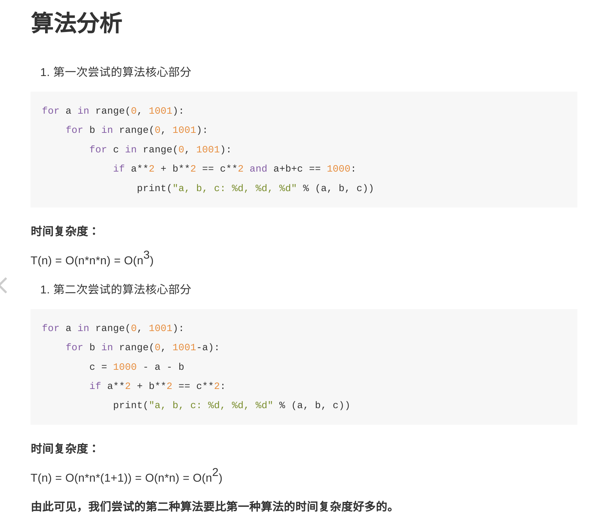
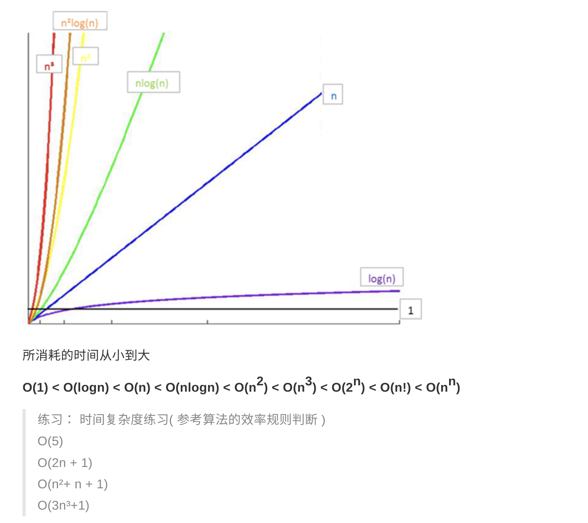

# 引言
如果 a+b+c=1000，且 a^2+b^2=c^2（a,b,c 为自然数），如何求出所有a、b、c可能的组合?
# intro
一般地，当算法在处理信息时，会从输入设备或数据的存储地址读取数据，把结果写入输出设备或某个存储地址供以后再调用。
## 算法复杂度

常见时间复杂度之间的关系：

ex:
logn复杂度
8个数中用二分查找找到1
1 2 3 4 5 6 7 8
第一次分成1 2 3 4 和 5 6 7 8 
第二次分成1 2和3 4
第三次分成1 2找到1了
一共在八个数中找了3次 所以是2**3=8所以log2n=3
所以算法复杂度是logn
同理 nlogn就是上述算法写进一个n的循环里就是nlogn的复杂度