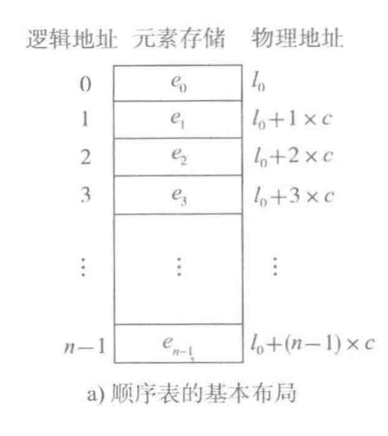
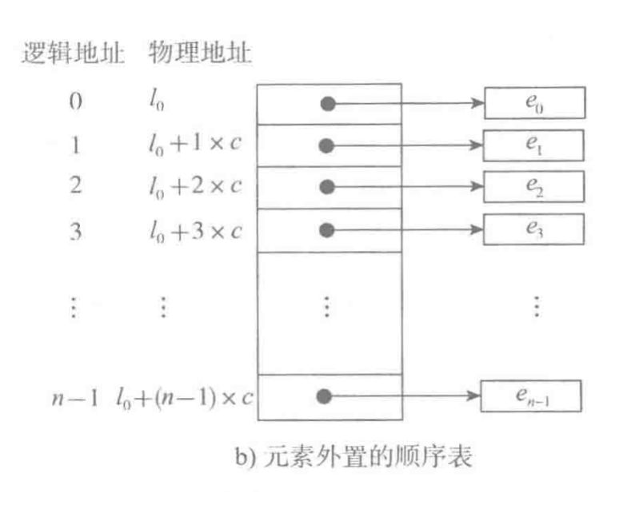
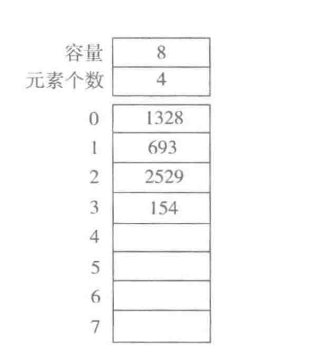
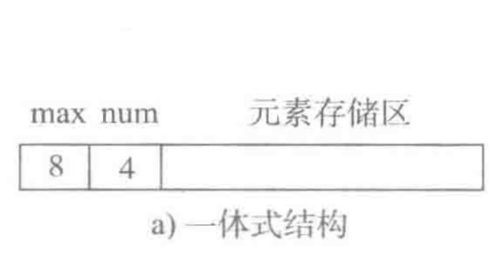
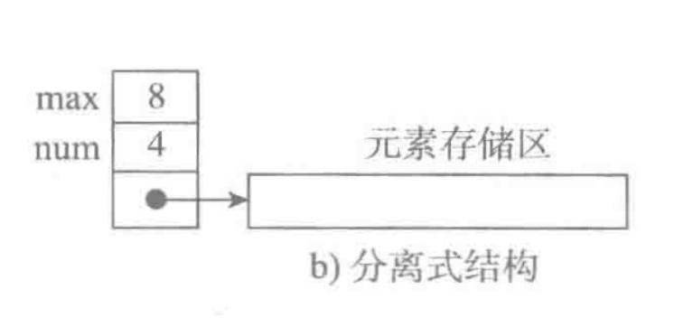

# 顺序表
将元素顺序地存放在一块连续的存储区里，元素间的顺序关系由它们的存储顺序自然表示。

最基本的顺序表每个元素的储存大小一致，那就可以分为逻辑地址和物理地址

如果每个元素的大小不一致，那就是更换为储存每个元素的链接地址（称为元素外置的顺序表）

# 顺序表的结构与实现
顺序表的完整信息包含每个元素的容量和一共有多少个元素

## 两种顺序表的实现方式
一种是一体式
元素储存区里包含所有元素，所以对象也包含了元素储存区的描述，即顺序表创建后，元素储存区就固定了

另一种是分离式
储存的是元素的地址链接和顺序表的基本信息，所以可以改动。

